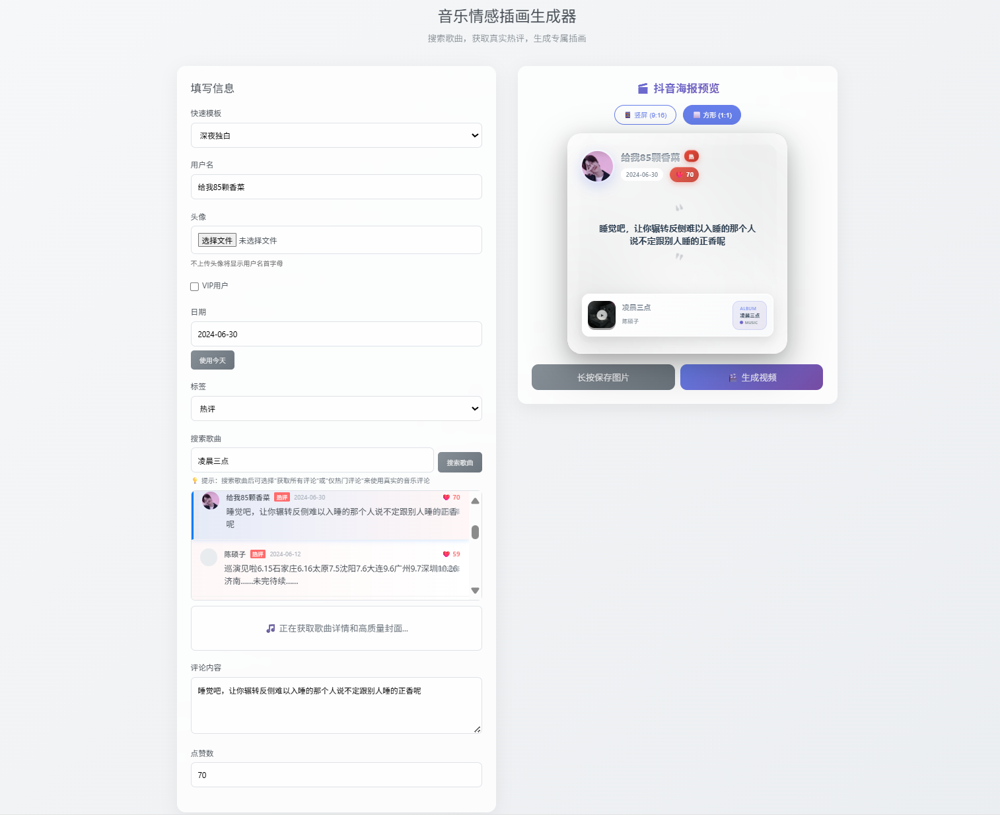

# 🎵 网易云音乐每日推荐插画生成器

一个简单易用的网易云音乐风格评论插画生成器，让你轻松创建个性化的音乐评论卡片。支持移动端和桌面端使用，完美还原网易云音乐的界面风格。

  

## � 项目预览

<div align="center">
  
  <p><em>🎨 网易云音乐评论插画生成器 - 界面预览</em></p>
</div>

> 💡 **提示**: 支持自定义用户名、评论内容、VIP标识、热评标签等，一键生成精美的网易云音乐风格评论插画！

## �🚀 快速开始

### 最简单的使用方式

1. 克隆项目到本地：
```bash
git clone https://github.com/Zhangfengmo/DailyRecommendMusicPanel.git
cd DailyRecommendMusicPanel
```

2. 直接打开 `simple.html` 文件即可使用！

### 开发环境搭建

```bash
# 安装依赖
npm install

# 启动开发服务器
npm run dev

# 访问 http://localhost:5173
```

## ✨ 功能特点

- 🎨 **网易云音乐风格设计** - 完美还原网易云音乐评论界面
- 📱 **移动端优化** - 响应式设计，完美适配各种移动设备
- 🖼️ **头像上传** - 支持自定义头像，或使用用户名首字母
- ⭐ **VIP标识** - 可选择是否显示VIP标识
- 🏷️ **多种标签** - 支持热评、精彩评论、最新评论等标签
- 📅 **日期自定义** - 可自定义日期或使用当前日期
- 💖 **点赞数设置** - 自定义点赞数量
- 📋 **快速模板** - 内置多个经典评论模板
- 💾 **图片导出** - 支持保存为图片（移动端长按，桌面端右键）

## 使用方法

### 方法一：直接使用（推荐）

1. 直接在浏览器中打开 `simple.html` 文件
2. 填写用户信息和评论内容
3. 实时预览生成的插画
4. 保存图片到本地

### 方法二：React开发版本

如果你想要开发或自定义功能：

1. 安装依赖：
```bash
npm install
```

2. 启动开发服务器：
```bash
npm run dev
```

3. 在浏览器中访问 `http://localhost:5173`

### 方法三：使用Python服务器

如果遇到CORS问题，可以使用内置的Python服务器：

```bash
python server.py
```

然后访问 `http://localhost:8000`

## 文件结构

```
MusicHtml/
├── simple.html          # 独立HTML版本（推荐使用）
├── server.py            # Python本地服务器
├── src/                 # React源码
│   ├── App.jsx          # 主应用组件
│   ├── App.css          # 主应用样式
│   ├── main.jsx         # 入口文件
│   ├── index.css        # 全局样式
│   └── components/      # 组件目录
│       ├── CommentCard.jsx    # 评论卡片组件
│       ├── CommentCard.css    # 评论卡片样式
│       ├── InputForm.jsx      # 输入表单组件
│       └── InputForm.css      # 输入表单样式
├── package.json         # 项目配置
├── vite.config.js       # Vite配置
├── index.html           # HTML模板
└── README.md           # 说明文档
```

## 使用技巧

### 移动端保存图片
1. 长按评论卡片区域
2. 选择"保存图片"或"添加到照片"
3. 图片将保存到相册

### 桌面端保存图片
1. 右键点击评论卡片
2. 选择"将图像另存为"
3. 或使用截图工具截取卡片区域

### 快速模板
- 选择预设模板可以快速填充经典评论内容
- 可以在模板基础上进行修改

## 自定义开发

如果你想要添加新功能或修改样式：

1. 编辑 `simple.html` 文件（简单修改）
2. 或者修改 `src/` 目录下的React组件（复杂功能）

## 浏览器兼容性

- ✅ Chrome (推荐)
- ✅ Safari
- ✅ Firefox
- ✅ Edge
- ✅ 移动端浏览器

## 🛠️ 技术栈

- **前端框架**: React 18 + Vite
- **样式**: CSS3 + 响应式设计
- **构建工具**: Vite
- **开发工具**: ESLint
- **图片处理**: 原生HTML5 Canvas API
- **本地服务器**: Python HTTP Server

## 📸 截图展示

### 桌面端界面
- 左侧：信息输入表单
- 右侧：实时预览效果

### 移动端界面
- 响应式布局，完美适配手机屏幕
- 触摸友好的交互设计

## 🚀 部署

### GitHub Pages 部署

1. Fork 这个项目
2. 在 GitHub 仓库设置中启用 GitHub Pages
3. 选择 `main` 分支作为源
4. 访问 `https://yourusername.github.io/DailyRecommendMusicPanel`

### 本地部署

```bash
# 构建项目
npm run build

# 预览构建结果
npm run preview
```

## 🤝 贡献指南

我们欢迎所有形式的贡献！

### 如何贡献

1. Fork 这个项目
2. 创建你的特性分支 (`git checkout -b feature/AmazingFeature`)
3. 提交你的更改 (`git commit -m 'Add some AmazingFeature'`)
4. 推送到分支 (`git push origin feature/AmazingFeature`)
5. 打开一个 Pull Request

### 报告问题

如果你发现了 bug 或有功能建议，请在 [Issues](https://github.com/Zhangfengmo/DailyRecommendMusicPanel/issues) 页面提交。

## 📄 许可证

本项目采用 MIT 许可证 - 查看 [LICENSE](LICENSE) 文件了解详情。

## 🙏 致谢

- 感谢网易云音乐提供的设计灵感
- 感谢所有贡献者的支持

## 📞 联系方式

如果你有任何问题或建议，欢迎通过以下方式联系：

- GitHub Issues: [提交问题](https://github.com/Zhangfengmo/DailyRecommendMusicPanel/issues)
- Email: [你的邮箱]

---

⭐ 如果这个项目对你有帮助，请给它一个星标！

享受创作你的专属网易云音乐评论插画吧！ 🎵✨
